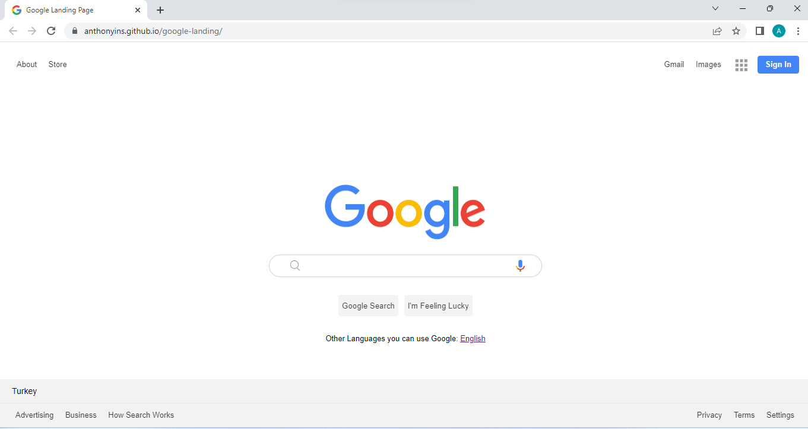

## Project-003 : Google Landing Page

## Description

Project aims to create google landing page.

## Project Skeleton

```
003-google-landing-page (folder)
|
|----readme.md
|----images
|----index.html
|----style.css
```

## Expected Outcome



## Objective

Build a Landing that is functionally similar to this: [Google Landing Page](https://anthonyins.github.io/google-landing/)

### At the end of the project, following topics are to be covered;

- HTML
- Css
  - List Properties-Tables
  - The Display Property
  - The position Property
  - The Float Property
  - Opacity / Transparency
  - Units in CSS
  - CSS Setting height and width
  - CSS Outline
  - CSS Combinators

## Resources

- [Images](./images)
